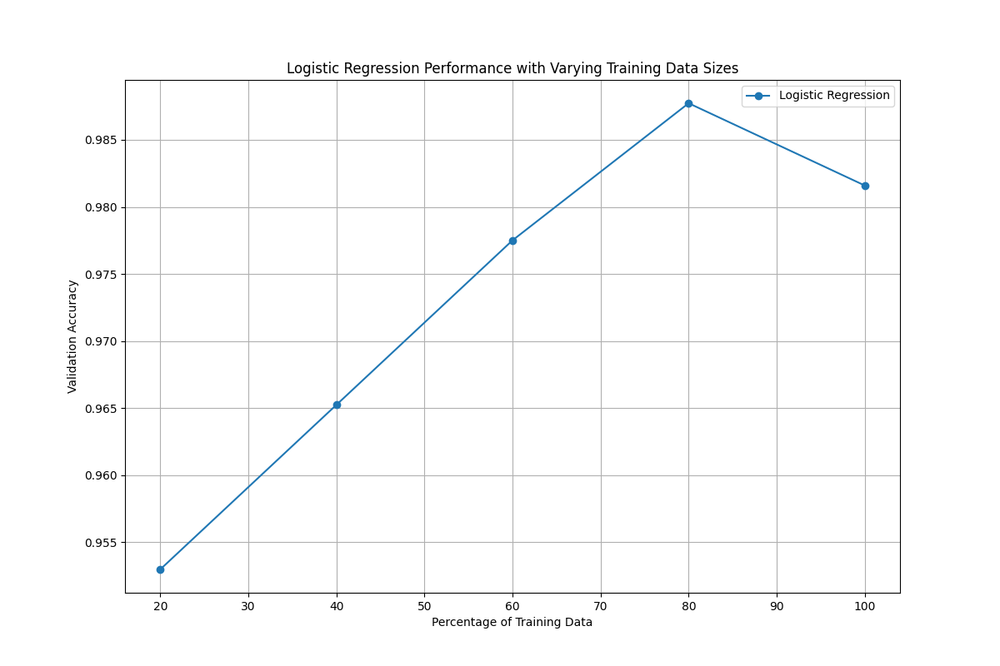

# CS771 Assignment: Deep Learning for Classification Tasks

## Dataset and Helper Code

You can download the datasets and some helper code from the following URL:

```
https://tinyurl.com/cs771-autumn24-mp-1-data
```

## Overview
This project implements three distinct machine learning models and an ensemble approach for binary classification tasks. Each model is designed to work with a different type of input data, demonstrating the versatility of various machine learning techniques.

## Dataset
The project uses three different datasets:
- **Emoji sequences**: Sequential emoji characters
- **Deep features**: Pre-extracted feature vectors
- **Text sequences**: Numerical digit sequences

## Models

### 1. Emoji LSTM Model
**Architecture:**
- Embedding layer to convert emoji tokens to vectors
- LSTM layer for capturing sequential patterns
- Dropout layer (0.5) for regularization
- Flatten layer for dimensionality reduction
- Dense layers with ReLU and softmax activations

**Implementation:**
```python
emoji_model = EmojiLSTMModel()
emoji_model.train('datasets/train/train_emoticon.csv', 'datasets/valid/valid_emoticon.csv')
emoji_model.predict('datasets/test/test_emoticon.csv')
```

### 2. Logistic Regression Model
**Architecture:**
- Standard logistic regression with L2 regularization
- Feature scaling with StandardScaler
- Trained with varying percentages of data (20%, 40%, 60%, 80%, 100%)

**Implementation:**
```python
logistic_model = LogisticRegressionModel(train_file, val_file, test_file)
logistic_model.train_model()
logistic_model.test_model()
```

### 3. CNN-LSTM Model
**Architecture:**
- Embedding layer for initial representation
- Two Conv1D layers with ReLU activation
- MaxPooling and Dropout layers for regularization
- Flatten layer for dimensionality reduction
- Dense layers with ReLU and sigmoid activations

**Implementation:**
```python
cnn_lstm = CNNLSTMModel(
    max_sequence_length=50, 
    num_unique_digits=10,
    embedding_output_dim=32,
    filters_1=32,
    filters_2=8,
    dense_units=64
)
cnn_lstm.build_model()
cnn_lstm.train(X_train, y_train_encoded, X_val, y_val_encoded, epochs=50, batch_size=16)
```

### 4. Ensemble Model
**Methodology:**
- Combines predictions from all three models using weighted voting
- Weights are determined based on validation accuracy
- Final prediction is calculated as: 
  `prediction = w1*logistic + w2*lstm + w3*cnn_lstm`
- Threshold of 0.5 determines final binary class

**Implementation:**
```python
combined_model = COMBINED_MODEL()
combined_model.train()
```

## Results
Each model generates predictions saved to separate files:
- `pred_emoticon_class.txt` - Emoji LSTM model predictions
- `pred_deepfeat_class.txt` - Logistic Regression model predictions
- `pred_textseq_class.txt` - CNN-LSTM model predictions 
- `weighted_vote_predictions_test.txt` - Ensemble model predictions

## Technical Details
- **Frameworks**: TensorFlow/Keras, scikit-learn
- **Libraries**: NumPy, Pandas, Matplotlib, Joblib
- **Techniques**: 
  - Sequence padding
  - Feature scaling
  - Label encoding
  - Model persistence

## Usage
1. Ensure datasets are properly placed in the `datasets/` directory
2. Install required dependencies
3. Run the main script:
   ```bash
   python 32.py
   ```

## Performance Analysis
The logistic regression model demonstrates how accuracy scales with training data size:
